<!DOCTYPE html>
<html lang="en">
<head>
  <meta charset="UTF-8">
  <meta name="viewport" content="width=device-width, initial-scale=1.0">
  <link href="https://cdn.jsdelivr.net/npm/tailwindcss@2.2.19/dist/tailwind.min.css" rel="stylesheet">
<!-- MathJax v3 CDN -->

</head>
<body>
      

        

In signal processing, basic matrices play crucial roles in various operations, forming the backbone of many algorithms and techniques. The identity matrix, a specific type of diagonal matrix, serves as a neutral element in matrix multiplication, crucial for preserving original signal values during transformations. Diagonal matrices streamline computations by allowing for independent scaling of signal components. Singular Value Decomposition (SVD) is a powerful tool in signal processing, extensively applied in noise reduction, data compression, and system identification. Matrix multiplication is fundamental in filtering, convolution, and applying linear transformations to signals, with convolution matrices specifically used to represent the effect of filters or kernels on signals.

        
The Fourier matrix is essential for converting signals between time and frequency domains in signal processing. Transposition is used in forming cross-correlation matrices and working with orthogonal bases, like in PCA. Determinants help analyze system stability and calculate volumes in multivariate Gaussian distributions, while eigenvalue decomposition simplifies the representation of systems and signal energy distribution.

        
LU decomposition is essential for solving linear equations, inverting matrices, and computing determinants. In signal processing, linear equations are crucial for various tasks, including filter design, system identification, and signal reconstruction. They are used to model and solve problems such as noise reduction, linear filtering, and Fourier transforms. Linear systems also underpin techniques like Principal Component Analysis (PCA) and Kalman filtering for estimation and prediction. Essentially, they provide the mathematical framework for manipulating and analyzing signals efficiently.

        
Row echelon form is a fundamental tool in linear algebra that supports various signal processing applications by simplifying the analysis and solution of linear systems, determining matrix rank, etc.

        
These foundational matrices enable efficient computation, representation, and manipulation of signals, serving as the building blocks for more complex signal processing tasks.

        

  
  <h2>Properties of Matrix Operations</h2>
  <h2>Properties of Matrix Addition</h2>
  
The fundamental properties of real number addition also apply to matrices.

  
Let \( A \), \( B \), and \( C \) be \( m \times n \) matrices:

  <ol>
    <li><strong>Commutative Property</strong>: \( A + B = B + A \)</li>
    <li><strong>Associative Property</strong>: \( A + (B + C) = (A + B) + C \)</li>
    <li><strong>Additive Identity</strong>: There exists a unique \( m \times n \) zero matrix \( O \) such that \( A + O = A \)</li>
    <li><strong>Additive Inverse</strong>: For every matrix \( A \), there exists \( -A \) such that \( A + (-A) = O \)</li>
  </ol>
  <h2>Properties of Matrix Multiplication</h2>
  
Unlike addition, not all multiplication properties of real numbers apply to matrices.

  <ul>
    <li>Matrix multiplication is <strong>not commutative</strong>: Even if both \( AB \) and \( BA \) are defined, they may not be equal.</li>
    <li>A matrix may not have a <strong>multiplicative inverse</strong>, even if it is square.</li>
  </ul>
  
However, some properties <strong>do generalize</strong>. Let \( A \), \( B \), and \( C \) be matrices such that the operations are defined:

  <ol>
    <li><strong>Associative Property</strong>: \( A(BC) = (AB)C \)</li>
    <li><strong>Left Distributive Property</strong>: \( A(B + C) = AB + AC \)</li>
    <li><strong>Right Distributive Property</strong>: \( (A + B)C = AC + BC \)</li>
    <li><strong>Multiplicative Identity</strong>: \( I_m A = A \), \( A I_n = A \)</li>
  </ol>
  <h2>Properties of Scalar Multiplication</h2>
  
Let \( r \), \( s \) be real numbers, and \( A \), \( B \) be matrices:

  <ol>
    <li>\( r(sA) = (rs)A \)</li>
    <li>\( (r + s)A = rA + sA \)</li>
    <li>\( r(A + B) = rA + rB \)</li>
    <li>\( A(rB) = r(AB) = (rA)B \) (if defined)</li>
  </ol>
  <h2>Properties of the Transpose of a Matrix</h2>
  
Let \( r \) be real, and \( A \), \( B \) be matrices:

  <ol>
    <li>\( (A^T)^T = A \)</li>
    <li>\( (A + B)^T = A^T + B^T \)</li>
    <li>\( (AB)^T = B^T A^T \)</li>
    <li>\( (rA)^T = rA^T \)</li>
  </ol>
  <h2>Properties of Determinants</h2>
  <ol>
    <li>\( \det(A) = \det(A^T) \)</li>
    <li>If any row/column is multiplied by \( k \), then \( \det(\Delta') = k \cdot \det(\Delta) \)</li>
    <li>If a row or column is all zeros, then \( \det = 0 \)</li>
    <li>If matrix is upper/lower triangular, \( \det = \) product of diagonal elements</li>
  </ol>

<h2>Matrix Theory: Minor, Cofactor, Adjoint, and Inverse</h2>

<h2>Matrix Multiplication Representation</h2>

Let matrix \( A \) be of size \( i \times k \), and matrix \( B \) be of size \( k \times j \). Their product \( C = A \cdot B \) will result in a matrix of size \( i \times j \).

The element in the \( i^{\text{th}} \) row and \( j^{\text{th}} \) column of the resulting matrix \( C \), denoted by \( c_{ij} \), is calculated as:

\( c_{ij} = \sum_k a_{ik} \cdot b_{kj} \)

The transpose of matrix \( C \), denoted as \( C^T \), swaps rows and columns, resulting in a matrix of size \( j \times i \):

\( C^T = [C]_{j \times i} \), where \( C^T_{ji} = C_{ij} \)

<h2>1. Transpose of a Product</h2>

<h3>1.a. Proof that \( (AB)^T = B^T A^T \)</h3>

The transpose of a product of two matrices equals the product of their transposes in reverse order. That is:

\( (AB)^T = B^T A^T \)

To see why this is true, consider the element at position \( (i, j) \) in \( (AB)^T \):

\( (AB)^T_{ij} = (AB)_{ji} = \sum_k a_{jk} \cdot b_{ki} \)

On the other hand, consider the element \( (i, j) \) in \( B^T A^T \):

\( (B^T A^T)_{ij} = \sum_k b^T_{ik} \cdot a^T_{kj} = \sum_k b_{ki} \cdot a_{jk} \)

Since both expressions are the same, we conclude:

\( (AB)^T = B^T A^T \)

<h3>1.b. Reverse Direction \( B^T A^T = (AB)^T \)</h3>

We can also prove this identity starting from the right-hand side:

\( (B^T A^T)_{ij} = \sum_k b^T_{ik} \cdot a^T_{kj} = \sum_k b_{ki} \cdot a_{jk} = (AB)_{ji} = (AB)^T_{ij} \)

<h2>2. Cofactor and Adjoint</h2>

<h3>Cofactor Matrix</h3>

The cofactor of the element in the \( i^{\text{th}} \) row and \( j^{\text{th}} \) column of a square matrix \( A \) is given by:

\( \text{CO}_{ij} = (-1)^{i+j} \cdot M_{ij} \)

Where \( M_{ij} \) is the <strong>minor</strong> of the element, i.e., the determinant of the submatrix formed by deleting the \( i^{\text{th}} \) row and \( j^{\text{th}} \) column from \( A \).

<h3>Adjoint</h3>

The adjoint (or adjugate) of a square matrix \( A \) is the transpose of the matrix of cofactors:

\( \text{Adj}(A) = [\text{CO}_{ij}]^T \)

<h2>3. Inverse of a Matrix</h2>

If matrix \( A \) is invertible (i.e., \( \det(A) \ne 0 \)), then the inverse of \( A \) is given by:

\( A^{-1} = \frac{\text{Adj}(A)}{\det(A)} \)

<h2>4. Inverse of a Product</h2>

The inverse of a product of two invertible matrices is the product of their inverses in reverse order:

\( (AB)^{-1} = B^{-1} A^{-1} \)

<strong>Proof:</strong>

Start with the identity:

\( (AB)(AB)^{-1} = I \)

Pre-multiply both sides by \( A^{-1} \):

\( A^{-1}(AB)(AB)^{-1} = A^{-1} \Rightarrow B(AB)^{-1} = A^{-1} \)

Now pre-multiply both sides by \( B^{-1} \):

\( B^{-1}B(AB)^{-1} = B^{-1}A^{-1} \Rightarrow (AB)^{-1} = B^{-1}A^{-1} \)

<h2>5. Adjoint of a Product</h2>

The adjoint of the product of two matrices equals the product of their adjoints in reverse order:

\( \text{Adj}(AB) = \text{Adj}(B) \cdot \text{Adj}(A) \)

<strong>Why this works:</strong>

From the inverse formula:

\( (AB)^{-1} = \frac{\text{Adj}(AB)}{\det(AB)} \)

We also have:

\( (AB)^{-1} = B^{-1} A^{-1} \), and \( \det(AB) = \det(A) \cdot \det(B) \)

Substitute the inverse formulas:

\( A^{-1} = \frac{\text{Adj}(A)}{\det(A)} \), and \( B^{-1} = \frac{\text{Adj}(B)}{\det(B)} \)

Multiply the adjoints accordingly:

\( \text{Adj}(B) \cdot \text{Adj}(A) = \det(A) \cdot \det(B) \cdot B^{-1} \cdot A^{-1} \)

Thus, from the original inverse formula:

\( \text{Adj}(AB) = \text{Adj}(B) \cdot \text{Adj}(A) \)

<h2 id = "ev">Eigenvalue and Eigenvector</h2>
			

				Let’s assume a square matrix <strong>A</strong>
			

			

				The characteristic equation,
			

			

				<strong>| A – </strong>λ*<strong>I | = </strong>0&#xa0;&#xa0; 
			

			

				<em>(where </em><strong><em>I </em></strong><em>is an identity matrix)</em>
			

			

				After calculating the values of λs we attempt to find eigenvectors for corresponding eigenvalues like this
			

			

				For eigenvalue, λ = λ1
			

			

				<strong>A*x</strong> = λ1*<strong>I*x</strong><strong>&#xa0;&#xa0; </strong><em>(where, </em><strong><em>x</em></strong><em> is an unknown vector)</em>
			

			

				Or, (<strong>A</strong> - λ1*<strong>I</strong>)*<strong>x</strong> = 0
			

			

				The value of <strong>x </strong>is the corresponding eigenvector of λ1
			

			

				&#xa0;
			

			

				<strong>Power Method for Dominant Eigenvalue</strong>
			

			

				Let λ1, λ2, λ3, and λn be the eigenvalues of an <strong>n X n </strong>matrix <strong>A</strong>.&#xa0; λ1 is called the dominant eigenvalue of <strong>A</strong> if
			

			

				| λ1| &gt; | λi |,&#xa0;&#xa0; <em>i = 2, 3, ... , n</em>
			

			

				The eigenvectors corresponding to λ1 are called dominant eigenvectors of <strong>A</strong>.
			

			

				&#xa0;
			

			

				<strong>Example</strong>
			

			

				A = 
			

			

				&#xa0;
			

			

				We begin with an initial nonzero approximation of
			

			

				<strong>x</strong><strong>0</strong> = 
			

			

				&#xa0;
			

			

				We then obtain the following approximations
			

			

				<strong>x</strong><strong>1</strong><strong> = Ax</strong><strong>0 </strong><strong>= </strong> = 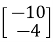 = -4
			

			

				<strong>&#xa0;</strong>
			

			

				<strong>x</strong><strong>2</strong><strong> = Ax</strong><strong>1 </strong><strong>= </strong> =  = 10
			

			

				<strong>x</strong><strong>3</strong><strong> = Ax</strong><strong>2 </strong><strong>= </strong> =  = -22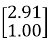
			

			

				&#xa0;
			

			

				<strong>x</strong><strong>4</strong><strong> = Ax</strong><strong>3 </strong><strong>= </strong> =  = 46
			

			

				&#xa0;
			

			

				<strong>x</strong><strong>5</strong><strong> = Ax</strong><strong>4 </strong><strong>= </strong> =  = -94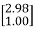
			

			

				<strong>x</strong><strong>6</strong><strong> = Ax</strong><strong>5 </strong><strong>= </strong> = 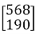 = 190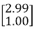
			

			

				&#xa0;
			

			

				Note that the approximations in Example appear to be approaching scalar multiples of 
			

			

				So, the obtained dominant eigenvector from the above iterations is
			

			

				<strong>x</strong> = 
			

			

				&#xa0;
			

			

				Now, we’ll find the corresponding eigenvalue from the obtained eigenvector
			

			

				&#xa0;
			

			

				<strong>Formula</strong>
			

			

				If <strong>x </strong>is an eigenvector of <strong>A</strong>, then its corresponding eigenvalue is given by 
			

			

				&#xa0;
			

			

				λ = (<strong>Ax.x / x.x</strong>)
			

			

				<strong>Ax </strong>=  = 
			

			

				Then, <strong>Ax.x = </strong> = -20.0 (approx.)
			

			

				And <strong>x.x </strong>=  =  = 9.94 (approx.)
			

			

				So, the corresponding eigenvalue, λ = (-20.0 / 9.94) = -2 (approx.)
			

			

				&#xa0;
			

			<h2 id = "svd">Singular Value Decomposition (SVD)</h2>
			

				<strong>Theory:</strong>
			

			

				Singular Value Decomposition (SVD) is a matrix factorization technique that decomposes any m×n matrix A into three matrices: A=UΣVT 
			

			

				Where:
			

			<ul>
				<li>
					U is an m×m orthogonal matrix (or unitary if complex).
				</li>
				<li>
					Σ is m×n diagonal matrix with non-negative real numbers on the diagonal (singular values).
				</li>
				<li>
					VT is an n×n orthogonal matrix (or unitary if complex), and VT is the transpose of V.
				</li>
			</ul>
			

				<strong>Example</strong>
			

			

				A = 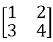
			

			

				&#xa0;
			

			

				Compute ATA and AAT
			

			

				&#xa0;
			

			

				ATA =  = 
			

			

				&#xa0;
			

			

				AAT =  = 
			

			

				&#xa0;
			

			

				<strong>Find Eigenvalues and Eigenvectors</strong>:
			

			

				For ATA:
			

			<ul>
				<li>
					Eigenvalues are λ1= 29.8661 and λ2 = 0.1339
				</li>
				<li>
					Corresponding eigenvectors (normalized) are v1 = and v2 = 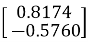
				</li>
			</ul>
			

				For AAT:
			

			<ul>
				<li>
					Eigenvalues are λ1= 29.8661 and λ2 = 0.1339
				</li>
				<li>
					Corresponding eigenvectors (normalized) are u1 = 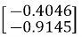and u2 = 
				</li>
			</ul>
			

				&#xa0;
			

			

				<strong>Compute Singular Values</strong>:
			

			

				Singular values are σ1 = √ 29.8661= 5.4650
			

			

				And σ1 = √ 0.1339 = 0.3660
			

			

				&#xa0;
			

			

				<strong>Final SVD:</strong>
			

			

				A=UΣVT
			

			

				Where: 
			

			

				U = &#xa0; Σ = &#xa0; 
			

			

				VT = 
			

			

				&#xa0;
			

			<h2 id = "lu">LU Decomposition</h2>
			

				LU Decomposition is a method to find solutions of linear equations.
			

			

				&#xa0;
			

			

				Using Gauss Elimination Method 
			

			

				&#xa0;
			

			

				Consider a matrix&#xa0;𝐴. If all entries below the diagonal entries are zero, then the matrix is called “upper triangular.” If all entries above the diagonal entries are zero, then the matrix is called “lower triangular.” 
			

			

				&#xa0;&#xa0;&#xa0;&#xa0;&#xa0;&#xa0;&#xa0;&#xa0; And <strong>A = L*U</strong>
			

			

				<strong>L</strong> =&#xa0; ;&#xa0;&#xa0; <strong>U</strong> = 
			

			

				&#xa0;
			

			

				<strong><em>L= lower triangular matrix; U= upper triangular matrix</em></strong>
			

			

				&#xa0;
			

			<ol start="5">
				<li>
					For a given matrix
				</li>
			</ol>
			

				<strong>A</strong> = 
			

			

				&#xa0;
			

			

				<strong>A=L*U</strong>
			

			

				Or, <strong>A</strong>=* 
			

			

				&#xa0;
			

			

				<strong><em>L= lower triangular matrix; U= upper triangular matrix</em></strong>
			

			

				&#xa0;
			

			

				After doing the row&#xa0;operation "R2 - (-2)*R1," we get,
			

			

				&#xa0;
			

			

				Or, <strong>A</strong> = * 
			

			

				&#xa0;
			

			

				After row operation in matrix <strong>U</strong>, we've set (-2) to the same place of the<strong> L</strong> matrix and the (2, 1)th position of the U matrix, which is now zero.
			

			

				Firstly, try the first column elements of matrix <strong>U</strong> below diagonal elements to make zeroes,
			

			

				&#xa0;
			

			

				After doing,&#xa0;&#xa0;&#xa0;&#xa0;&#xa0;&#xa0;&#xa0;&#xa0;&#xa0; ‘R2-(-2)*R1’ <em>(as demonstrated above)</em>
			

			

				&#xa0;&#xa0;&#xa0;&#xa0;&#xa0;&#xa0;&#xa0;&#xa0;&#xa0;&#xa0;&#xa0;&#xa0;&#xa0;&#xa0;&#xa0;&#xa0;&#xa0;&#xa0;&#xa0;&#xa0;&#xa0;&#xa0;&#xa0;&#xa0;&#xa0;&#xa0;&#xa0;&#xa0;&#xa0; ‘R3-(3)*R1’ and
			

			

				&#xa0;&#xa0;&#xa0;&#xa0;&#xa0;&#xa0;&#xa0;&#xa0;&#xa0;&#xa0;&#xa0;&#xa0;&#xa0;&#xa0;&#xa0;&#xa0;&#xa0;&#xa0;&#xa0;&#xa0;&#xa0;&#xa0;&#xa0;&#xa0;&#xa0;&#xa0;&#xa0;&#xa0;&#xa0; ‘R4-(2)*R1’
			

			

				We get,
			

			

				&#xa0;
			

			

				<strong>A</strong> = * 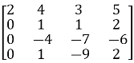
			

			

				&#xa0;
			

			

				In a same way, we will now employ row operations to set the elements of the second column of matrix <strong>U</strong> to zero.
			

			

				&#xa0;
			

			

				Calculate,&#xa0;&#xa0;&#xa0; ‘R3-(-4)*R2’ and
			

			

				&#xa0;&#xa0;&#xa0;&#xa0;&#xa0;&#xa0;&#xa0;&#xa0;&#xa0;&#xa0;&#xa0;&#xa0;&#xa0;&#xa0;&#xa0;&#xa0;&#xa0;&#xa0;&#xa0; ‘R4-(1)*R2’
			

			

				&#xa0;
			

			

				We get,
			

			

				<strong>A</strong> = * 
			

			

				&#xa0;
			

			

				Now, we'll apply row operations to convert the elements of the third column of matrix <strong>U</strong> to zeroes.
			

			

				&#xa0;
			

			

				Now calculate "R4-(3)*R2"
			

			

				We get,
			

			

				&#xa0;
			

			

				<strong>A</strong> = * 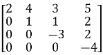
			

			

				&#xa0;
			

			

				So, 
			

			

				&#xa0;
			

			

				<strong>L</strong> = 
			

			

				&#xa0;
			

			

				<strong>U</strong> = 
			

			

				&#xa0;
			

			<ol start="6">
				<li>
					<strong>Before showing the final result, all intermediate steps must be displayed.</strong>
				</li>
			</ol>
			

				&#xa0;
			

			<h2>Row Echelon Form</h2>
			

				A matrix is in row echelon form if
			

			<ul>
				<li>
					All rows consisting of only zeroes are at the bottom.
				</li>
				<li>
					The leading entry (that is the left-most nonzero entry) of every nonzero row is to the right of the leading entry of every row above
				</li>
				<li>
					Some texts add the condition that the leading coefficient must be 1 while others regard this as reduced row echelon form
				</li>
				<li>
					These two conditions imply that all entries in a column below a leading coefficient are zeros
				</li>
			</ul>
			

				&#xa0;
			

			

				&#xa0;
			

			

				<strong>Example</strong>
			

			

				Given matrix,
			

			

				<strong>A = </strong>
			

			

				&#xa0;
			

			

				R2 ← R2 – R1
			

			

				
			

			

				<strong>&#xa0;</strong>
			

			

				R3 ← R3 + 2*R2
			

			

				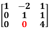
			

			

				<strong>&#xa0;</strong>
			

			

				R3 ← R3 / 4
			

			

				
			

			

				&#xa0;
			

			<h2>Rank of a Matrix</h2>
			

				<strong>Theory:</strong>
			

			

				<strong>Definition</strong>: The rank of a matrix is defined as the maximum number of linearly independent rows (or columns) in the matrix. It can also be seen as the dimension of the row space or column space of the matrix.
			

			

				&#xa0;
			

			

				<strong>Rank of a Matrix in Row Echelon Form (REF)</strong>
			

			<ol>
				<li>
					<strong>Row Echelon Form (REF)</strong>: A matrix is in row echelon form when:
					<ul>
						<li>
							All non-zero rows are above any rows of all zeros.
						</li>
						<li>
							The leading entry (pivot) of each non-zero row is to the right of the leading entry of the row above it.
						</li>
						<li>
							All entries below a pivot are zero.
						</li>
					</ul>
				</li>
			</ol>
			

				&#xa0;
			

			<ol start="2">
				<li>
					<strong>Finding the Rank</strong>:
					<ul>
						<li>
							<strong>Identify Non-Zero Rows</strong>: In REF, the rank of the matrix is equal to the number of non-zero rows. This is because each non-zero row represents a linearly independent vector in the row space of the matrix.
						</li>
						<li>
							<strong>Process</strong>: Convert the matrix to REF using row operations (row swapping, scaling rows, adding/subtracting multiples of rows) and count the number of non-zero rows to determine the rank.
						</li>
					</ul>
				</li>
			</ol>
			

				&#xa0;
			

</body>
</html>
