<<<<<<< HEAD
<!DOCTYPE html>
<html lang="en">
<head>
  <meta charset="UTF-8">
  <meta name="viewport" content="width=device-width, initial-scale=1.0">
  <link href="https://cdn.jsdelivr.net/npm/tailwindcss@2.2.19/dist/tailwind.min.css" rel="stylesheet">
</head>
<body>
      

        

In signal processing, basic matrices play crucial roles in various operations, forming the backbone of many algorithms and techniques. The identity matrix, a specific type of diagonal matrix, serves as a neutral element in <a href ="./theory/Properties.pdf">matrix multiplication</a>, crucial for preserving original signal values during transformations. Diagonal matrices streamline computations by allowing for independent scaling of signal components. <a href ="./theory/Singular_Value_Decomposition.pdf">Singular Value Decomposition (SVD)</a> is a powerful tool in signal processing, extensively applied in noise reduction, data compression, and system identification. Matrix multiplication is fundamental in filtering, convolution, and applying linear transformations to signals, with convolution matrices specifically used to represent the effect of filters or kernels on signals.

        
The Fourier matrix is essential for converting signals between time and frequency domains in signal processing. <a href ="./theory/Properties.pdf">Transposition</a> is used in forming cross-correlation matrices and working with orthogonal bases, like in PCA. Determinants help analyze system stability and calculate volumes in multivariate Gaussian distributions, while <a href ="./theory/EigenValue_and_EigenVector.pdf">eigenvalue decomposition</a> simplifies the representation of systems and signal energy distribution.

        
<a href ="./theory/LU_Decomposition.html">LU decomposition</a> is essential for solving linear equations, inverting matrices, and computing determinants. In signal processing, linear equations are crucial for various tasks, including filter design, system identification, and signal reconstruction. They are used to model and solve problems such as noise reduction, linear filtering, and Fourier transforms. Linear systems also underpin techniques like Principal Component Analysis (PCA) and Kalman filtering for estimation and prediction. Essentially, they provide the mathematical framework for manipulating and analyzing signals efficiently.

        
<a href ="./theory/Row_Echelon_Form.html">Row echelon form</a> is a fundamental tool in linear algebra that supports various signal processing applications by simplifying the analysis and solution of linear systems, determining matrix rank, etc.

        
These foundational matrices enable efficient computation, representation, and manipulation of signals, serving as the building blocks for more complex signal processing tasks.

        

  

    <ol class="mb-4 pl-4">
      <li>
        <a href="./theory/Properties.pdf">
          

            1.
            

              Properties of Matrix Operations (Addition, Multiplication, Transpose, Determinants, Minor, Co-factor, Adjoint, Inverse, etc.)
            

          

        </a>
      </li>
      <li>
        <a href="./theory/EigenValue_and_EigenVector.pdf">
          

            2.
            

              Eigenvalue and EigenVector
            

          

        </a>
      </li>
      <li>
        <a href="./theory/Singular_Value_Decomposition.pdf">
          

            3.
            

              Singular Value Decomposition (SVD)
            

          

        </a>
      </li>
      <li>
        <a href="./theory/LU_Decomposition.html">
          

            4.
            

              LU Decomposition Method
            

          

        </a>
      </li>
      <li>
        <a href="./theory/Row_Echelon_Form.html">
          

            5.
            

              Row Echelon Form
            

          

        </a>
      </li>
      <li>
        <a href="./theory/Reduced_Row_Echelon_Form.html">
          

            6.
            

              Reduced Row Echelon Form
            

          

        </a>
      </li>
      <li>
        <a href="./theory/Rank.pdf">
          

            7.
            

              Rank of a Matrix
            

          

        </a>
      </li>
    </ol>
  

</body>
</html>
=======
<!DOCTYPE html>
<html lang="en">
<head>
  <meta charset="UTF-8">
  <meta name="viewport" content="width=device-width, initial-scale=1.0">
  <link href="https://cdn.jsdelivr.net/npm/tailwindcss@2.2.19/dist/tailwind.min.css" rel="stylesheet">
</head>
<body>
      

        

In signal processing, basic matrices play crucial roles in various operations, forming the backbone of many algorithms and techniques. The identity matrix, a specific type of diagonal matrix, serves as a neutral element in matrix multiplication, crucial for preserving original signal values during transformations. Diagonal matrices streamline computations by allowing for independent scaling of signal components. Singular Value Decomposition (SVD) is a powerful tool in signal processing, extensively applied in noise reduction, data compression, and system identification. Matrix multiplication is fundamental in filtering, convolution, and applying linear transformations to signals, with convolution matrices specifically used to represent the effect of filters or kernels on signals.

        
The Fourier matrix is essential for converting signals between time and frequency domains in signal processing. Transposition is used in forming cross-correlation matrices and working with orthogonal bases, like in PCA. Determinants help analyze system stability and calculate volumes in multivariate Gaussian distributions, while eigenvalue decomposition simplifies the representation of systems and signal energy distribution.

        
LU decomposition is essential for solving linear equations, inverting matrices, and computing determinants. In signal processing, linear equations are crucial for various tasks, including filter design, system identification, and signal reconstruction. They are used to model and solve problems such as noise reduction, linear filtering, and Fourier transforms. Linear systems also underpin techniques like Principal Component Analysis (PCA) and Kalman filtering for estimation and prediction. Essentially, they provide the mathematical framework for manipulating and analyzing signals efficiently.

        
Row echelon form is a fundamental tool in linear algebra that supports various signal processing applications by simplifying the analysis and solution of linear systems, determining matrix rank, etc.

        
These foundational matrices enable efficient computation, representation, and manipulation of signals, serving as the building blocks for more complex signal processing tasks.

        

  

				<strong>Properties of Matrix Operations</strong>
			

			

				<strong>Properties</strong><strong>&#xa0;</strong><strong>of Addition</strong>
			

			

				The basic properties of addition for real numbers also hold true for matrices.&#xa0;
			

			

				Let&#xa0;A,&#xa0;B&#xa0;and&#xa0;C&#xa0;be&#xa0;m x n&#xa0;matrices
			

			<ol>
				<li>
					A + B&#xa0; =&#xa0; B + A&#xa0;&#xa0;&#xa0;&#xa0;commutative
				</li>
				<li>
					A + (B + C)&#xa0; =&#xa0; (A + B) + C&#xa0;&#xa0;&#xa0;&#xa0;associative
				</li>
				<li>
					There is a unique&#xa0;m x n&#xa0;matrix&#xa0;O&#xa0;with&#xa0;&#xa0;&#xa0;&#xa0;&#xa0;&#xa0;&#xa0;&#xa0;A + O&#xa0; =&#xa0; A&#xa0;&#xa0;&#xa0;&#xa0;&#xa0;&#xa0;&#xa0;&#xa0;additive identity
				</li>
				<li>
					For any&#xa0;&#xa0;m x n&#xa0;matrix&#xa0;A&#xa0;there is an&#xa0;m x n&#xa0;matrix&#xa0;B&#xa0;(called&#xa0;-A) with&#xa0;&#xa0;&#xa0;&#xa0;&#xa0;&#xa0;&#xa0;A + B&#xa0; =&#xa0; O&#xa0;&#xa0;&#xa0;&#xa0;&#xa0;&#xa0;&#xa0;&#xa0;additive inverse
				</li>
			</ol>
			

				&#xa0;
			

			

				<strong>Properties of Matrix</strong><strong>&#xa0;</strong><a><strong>Multiplication</strong></a>
			

			

				Unlike matrix addition, the properties of multiplication of real numbers do not all generalize to matrices.&#xa0; Matrices rarely commute even if&#xa0;AB&#xa0;and&#xa0;BA&#xa0;are both defined.&#xa0; There often is no multiplicative inverse of a matrix, even if the matrix is a square matrix.&#xa0; There are a few properties of multiplication of real numbers that generalize to matrices.&#xa0; We state them now.
			

			

				Let&#xa0;A,&#xa0;B&#xa0;and&#xa0;C&#xa0;be matrices of dimensions such that the following are defined.&#xa0; Then
			

			<ol>
				<li>
					A(BC)&#xa0; =&#xa0; (AB)C&#xa0;&#xa0;&#xa0;&#xa0;&#xa0;&#xa0;&#xa0;&#xa0;&#xa0;&#xa0;&#xa0;&#xa0;&#xa0;&#xa0;&#xa0;&#xa0; associative
				</li>
				<li>
					A(B + C)&#xa0; =&#xa0; AB + AC&#xa0;&#xa0;&#xa0;&#xa0;&#xa0;&#xa0;&#xa0;&#xa0;distributive
				</li>
				<li>
					(A + B)C&#xa0; =&#xa0; AC + BC&#xa0;&#xa0;&#xa0;&#xa0;&#xa0;&#xa0;&#xa0;&#xa0;distributive
				</li>
				<li>
					There are unique matrices&#xa0;Im&#xa0;and&#xa0;In&#xa0;with&#xa0;&#xa0;&#xa0;&#xa0;&#xa0;&#xa0;&#xa0; Im&#xa0;A&#xa0; =&#xa0; A In&#xa0; =&#xa0; A&#xa0;&#xa0;&#xa0;&#xa0;&#xa0;&#xa0;&#xa0;&#xa0;multiplicative identity
				</li>
			</ol>
			

				<strong>&#xa0;</strong>
			

			

				<strong>Properties of</strong><strong>&#xa0;</strong><a><strong>Scalar</strong></a><strong>&#xa0;</strong><strong>Multiplication</strong>
			

			

				Since we can multiply a matrix by a scalar, we can investigate the properties that this multiplication has.&#xa0; All of the properties of multiplication of real numbers generalize.&#xa0; In particular, we have
			

			

				Let&#xa0;r&#xa0;and&#xa0;s&#xa0;be real numbers and&#xa0;A&#xa0;and&#xa0;B&#xa0;be matrices.&#xa0; Then
			

			<ol>
				<li>
					r(sA)&#xa0; =&#xa0; (rs)A&#xa0;
				</li>
				<li>
					(r + s)A&#xa0; =&#xa0; rA + sA
				</li>
				<li>
					r(A + B)&#xa0; =&#xa0; rA + rB
				</li>
				<li>
					A(rB)&#xa0; =&#xa0; r(AB)&#xa0; =&#xa0; (rA)B
				</li>
			</ol>
			

				&#xa0;
			

			

				<strong>Properties of the</strong><strong>&#xa0;</strong><a><strong>Transpose</strong></a><strong>&#xa0;</strong><strong>of a Matrix</strong>
			

			

				Recall that the transpose of a matrix is the operation of switching rows and columns.&#xa0; We state the following properties.&#xa0; We proved the first property in the last section.
			

			

				Let&#xa0;r&#xa0;be a real number and&#xa0;A&#xa0;and&#xa0;B&#xa0;be matrices.&#xa0; Then
			

			<ol>
				<li>
					(AT)T&#xa0; =&#xa0; A
				</li>
				<li>
					(A + B)T&#xa0; =&#xa0; AT&#xa0;+ BT
				</li>
				<li>
					(AB)T&#xa0; =&#xa0; BTAT
				</li>
				<li>
					(rA)T&#xa0; =&#xa0; rAT
				</li>
			</ol>
			

				&#xa0;
			

			

				<strong>Properties of Determinants</strong>
			

			<ol>
				<li>
					det(A) = &#xa0;det(AT)
				</li>
				<li>
					If any row or column of a determinant, is multiplied by any scalar value, that is, a non-zero constant, the entire determinant gets multiplied by the same scalar, that is, if any row or column is multiplied by constant k, the determinant value gets multiplied by k.
				</li>
			</ol>
			

				&#xa0;&#xa0;&#xa0;&#xa0;&#xa0;&#xa0;&#xa0;&#xa0;&#xa0;&#xa0;&#xa0;&#xa0;&#xa0;&#xa0;&#xa0;&#xa0;&#xa0;&#xa0;&#xa0;&#xa0;&#xa0;&#xa0;&#xa0;&#xa0;&#xa0;&#xa0;&#xa0;&#xa0;&#xa0;&#xa0;&#xa0;&#xa0;&#xa0;&#xa0;&#xa0;&#xa0;&#xa0;&#xa0;&#xa0;&#xa0;&#xa0;&#xa0;&#xa0;&#xa0;&#xa0;&#xa0;&#xa0;&#xa0;&#xa0; det(Δ’) = k det(Δ)
			

			<ol start="3">
				<li>
					If all elements of any column or row are zero, then the determinant is zero
				</li>
				<li>
					If all the elements in the determinant above or below the diagonal are zero, then the determinant is a product of diagonal elements
				</li>
			</ol>
			

				<strong>&#xa0;</strong>
			

			

				<strong>Minor, Co-factor, Adjoint, Inverse</strong>
			

			

				[A](i x k) <strong>.</strong> [B](k x j)
			

			

				=
			

			

				= = [C]ij
			

			

				Where, cij =  aikbkj
			

			

				&#xa0;
			

			

				CT =  = [C]ji
			

			

				Where, CT is transpose of matrix C
			

			

				&#xa0;
			

			

				<strong>1. a.)</strong>
			

			

				<strong>(A.B)</strong><strong>T</strong><strong> = B</strong><strong>T</strong><strong>.A</strong><strong>T</strong>
			

			

				(A.B)Tij 
			

			

				= (A.B)ji
			

			

				= ajkbki
			

			

				= bkiajk
			

			

				= (bT )ik (aT)kj
			

			

				= (BTAT)ij
			

			

				&#xa0;
			

			

				<strong>(1. b.)</strong>
			

			

				<strong>B</strong><strong>T</strong><strong>.A</strong><strong>T </strong><strong>= (A.B)</strong><strong>T</strong>
			

			

				&#xa0;(BTAT)ij
			

			

				= (bT)ik&#xa0; .&#xa0; (aT)kj
			

			

				= (b)ki&#xa0; .&#xa0; (a)jk
			

			

				= (a)jk . (b)ki&#xa0;&#xa0;&#xa0; 
			

			

				= (AB)ji
			

			

				= (AB)Tij
			

			

				&#xa0;
			

			

				Cofactor Matrix of a matrix A
			

			

				[COij] =&#xa0; (-1)(i+j) *
			

			

				Where, 
			

			

				Mij is the entry in the ith row and jth column
			

			

				&#xa0;
			

			

				Adjoint of a matrix, A
			

			

				Adj(A) = [COij]T
			

			

				&#xa0;
			

			

				Now, the inverse of the matrix A
			

			

				A-1 = Adj(A) / det(A)
			

			

				Where ‘det’ denotes the determinant
			

			

				&#xa0;
			

			

				<strong>2. (AB)</strong><strong>−1</strong><strong>=B</strong><strong>−1</strong><strong>A</strong><strong>−1</strong>
			

			

				If A and B are invertible matrices or Both A and B are <strong>n X n</strong> square matrices and determinants are not zeroes then
			

			

				(AB)(AB)-1 = I 
			

			

				Where I is the identity matrix of size <strong>n X n</strong>
			

			

				&#xa0;Pre-multiply by A-1
			

			

				(A-1 ). (AB)(AB)-1 = A-1I
			

			

				Or, I.(B).(AB)-1 = A-1
			

			

				Or,&#xa0; (B).(AB)-1 = A-1
			

			

				&#xa0;
			

			

				Pre-multiply by B-1
			

			

				(B-1 ). (B).(AB)-1 = B-1A-1
			

			

				Or, I(AB)-1 = B-1A-1
			

			

				Or, (AB)-1 = B-1A-1
			

			

				<strong>&#xa0;</strong>
			

			

				<strong>3. Adj(A . B) = Adj(B) . Adj(A)</strong>
			

			

				(AB)−1=adj(AB)/det(AB)
			

			

				Or, adj(AB) = (AB)−1⋅det(AB)&#xa0;&#xa0;&#xa0;&#xa0;&#xa0;&#xa0;&#xa0;&#xa0;&#xa0;&#xa0;&#xa0;&#xa0;&#xa0;&#xa0;&#xa0;&#xa0;&#xa0;&#xa0;&#xa0;&#xa0;&#xa0; . . . (1)
			

			

				&#xa0;
			

			

				It is also known that, (AB)−1=B-1A−1
			

			

				And, det(AB)=det(A)⋅det(B)&#xa0;&#xa0;&#xa0;&#xa0;&#xa0;&#xa0;&#xa0;&#xa0;&#xa0;&#xa0;&#xa0;&#xa0;&#xa0;&#xa0;&#xa0;&#xa0;&#xa0;&#xa0;&#xa0;&#xa0;&#xa0;&#xa0;&#xa0; . . . (2)
			

			

				&#xa0;
			

			

				Also
			

			

				A−1=adj(A)/det(A) 
			

			

				B−1=adj(B)/det(B)
			

			

				Or, adj(A)=A-1det(A) 
			

			

				Or, adj(B)=B−1det(B)
			

			

				&#xa0;
			

			

				adj(B)⋅adj(A)=detA⋅detB⋅B−1⋅A−1&#xa0;&#xa0;&#xa0;&#xa0;&#xa0;&#xa0;&#xa0;&#xa0;&#xa0;&#xa0;&#xa0;&#xa0;&#xa0;&#xa0;&#xa0;&#xa0;&#xa0; . . . (3)
			

			

				&#xa0;
			

			

				Putting (2) in equation (1)
			

			

				adj(AB)=det(A)⋅det(B)⋅B−1⋅A−1&#xa0;&#xa0;&#xa0;&#xa0;&#xa0;&#xa0;&#xa0;&#xa0;&#xa0;&#xa0;&#xa0;&#xa0;&#xa0;&#xa0;&#xa0;&#xa0;&#xa0;&#xa0;&#xa0;&#xa0; . . . (4)
			

			

				&#xa0;
			

			

				From (3) and (4)
			

			

				adj(AB)=adj(B)⋅adj(A)
			

			

				&#xa0;
			

			

				<strong>Eigenvalue and Eigenvector</strong>
			

			

				Let’s assume a square matrix <strong>A</strong>
			

			

				The characteristic equation,
			

			

				<strong>| A – </strong>λ*<strong>I | = </strong>0&#xa0;&#xa0; 
			

			

				<em>(where </em><strong><em>I </em></strong><em>is an identity matrix)</em>
			

			

				After calculating the values of λs we attempt to find eigenvectors for corresponding eigenvalues like this
			

			

				For eigenvalue, λ = λ1
			

			

				<strong>A*x</strong> = λ1*<strong>I*x</strong><strong>&#xa0;&#xa0; </strong><em>(where, </em><strong><em>x</em></strong><em> is an unknown vector)</em>
			

			

				Or, (<strong>A</strong> - λ1*<strong>I</strong>)*<strong>x</strong> = 0
			

			

				The value of <strong>x </strong>is the corresponding eigenvector of λ1
			

			

				&#xa0;
			

			

				<strong>Power Method for Dominant Eigenvalue</strong>
			

			

				Let λ1, λ2, λ3, and λn be the eigenvalues of an <strong>n X n </strong>matrix <strong>A</strong>.&#xa0; λ1 is called the dominant eigenvalue of <strong>A</strong> if
			

			

				| λ1| &gt; | λi |,&#xa0;&#xa0; <em>i = 2, 3, ... , n</em>
			

			

				The eigenvectors corresponding to λ1 are called dominant eigenvectors of <strong>A</strong>.
			

			

				&#xa0;
			

			

				<strong>Procedure</strong>
			

			<ol>
				<li>
					Choose an <strong>n X n </strong>matrix
				</li>
			</ol>
			

				<strong><em>The number of rows and columns should be the same (or matrix dimension mismatched)</em></strong>
			

			

				&#xa0;
			

			<ol start="2">
				<li>
					Like the Jacobi and Gauss-Seidel methods, the power method for approximating eigenvalues is iterative. First, we assume that matrix <strong>A</strong> has a dominant eigenvalue with corresponding dominant eigenvectors. Then we choose an initial approximation <strong>x</strong><strong>0</strong> of one of the
				</li>
			</ol>
			

				dominant eigenvectors of <strong>A</strong>. This initial approximation must be a nonzero vector in R<em>n </em>
			

			

				&#xa0;
			

			

				Finally, we form the sequence given by
			

			

				<strong>x</strong><strong>1</strong><strong> = Ax</strong><strong>0</strong>
			

			

				<strong>x</strong><strong>2</strong><strong> = Ax</strong><strong>1 </strong><strong>= A(Ax</strong><strong>0</strong><strong>) = A</strong><strong>2</strong><strong>x</strong><strong>0</strong>
			

			

				<strong>x</strong><strong>3</strong><strong> = Ax</strong><strong>2 </strong><strong>= A(A</strong><strong>2</strong><strong>x</strong><strong>0</strong><strong>) = A</strong><strong>3</strong><strong>x</strong><strong>0</strong>
			

			

				<strong>. . .</strong>
			

			

				<strong>x</strong><strong>n</strong><strong> = Ax</strong><strong>n-1 </strong><strong>= A(A</strong><strong>n-1</strong><strong>x</strong><strong>0</strong><strong>) = A</strong><strong>n</strong><strong>x</strong><strong>0</strong>
			

			

				<em>(In the above, </em><strong><em>x</em></strong><strong><em>1 </em></strong><em>denotes</em><strong><em> </em></strong><em>the</em><strong><em> </em></strong><em>value of vector </em><strong><em>x </em></strong><em>at the first iteration and so on)</em>
			

			

				&#xa0;
			

			

				Compare the updated value of <strong>x </strong>with its previous value (obtained from the previous iteration)
			

			

				&#xa0;
			

			

				For large powers of k, and by properly scaling this sequence, we will see that we obtain a good approximation of the dominant eigenvector of <strong>A</strong>. 
			

			

				&#xa0;
			

			<ol start="3">
				<li>
					Repeat the iteration process until convergence
				</li>
			</ol>
			

				&#xa0;
			

			<ol start="4">
				<li>
					The formula for finding the corresponding eigenvalue from eigenvector x.
				</li>
			</ol>
			

				If <strong>x </strong>is an eigenvector of <strong>A</strong>, then its corresponding eigenvalue is given by 
			

			

				&#xa0;
			

			

				λ = (<strong>Ax.x / x.x</strong>)
			

			

				&#xa0;
			

			

				&#xa0;
			

			<ol start="5">
				<li>
					If they do not converge even after many iterations (maybe after 1000 iterations), then
				</li>
			</ol>
			

				<strong><em>Entered matrix has no dominant eigenvalue</em></strong>
			

			

				&#xa0;
			

			

				<strong>Example</strong>
			

			

				A = 
			

			

				&#xa0;
			

			

				We begin with an initial nonzero approximation of
			

			

				<strong>x</strong><strong>0</strong> = 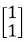
			

			

				&#xa0;
			

			

				We then obtain the following approximations
			

			

				<strong>x</strong><strong>1</strong><strong> = Ax</strong><strong>0 </strong><strong>= </strong>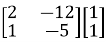 =  = -4
			

			

				<strong>&#xa0;</strong>
			

			

				<strong>x</strong><strong>2</strong><strong> = Ax</strong><strong>1 </strong><strong>= </strong> =  = 10
			

			

				<strong>x</strong><strong>3</strong><strong> = Ax</strong><strong>2 </strong><strong>= </strong> = 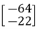 = -22
			

			

				&#xa0;
			

			

				<strong>x</strong><strong>4</strong><strong> = Ax</strong><strong>3 </strong><strong>= </strong> = 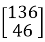 = 46
			

			

				&#xa0;
			

			

				<strong>x</strong><strong>5</strong><strong> = Ax</strong><strong>4 </strong><strong>= </strong>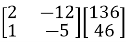 = 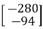 = -94
			

			

				<strong>x</strong><strong>6</strong><strong> = Ax</strong><strong>5 </strong><strong>= </strong>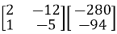 =  = 190
			

			

				&#xa0;
			

			

				Note that the approximations in Example appear to be approaching scalar multiples of 
			

			

				So, the obtained dominant eigenvector from the above iterations is
			

			

				<strong>x</strong> = 
			

			

				&#xa0;
			

			

				Now, we’ll find the corresponding eigenvalue from the obtained eigenvector
			

			

				&#xa0;
			

			

				<strong>Formula</strong>
			

			

				If <strong>x </strong>is an eigenvector of <strong>A</strong>, then its corresponding eigenvalue is given by 
			

			

				&#xa0;
			

			

				λ = (<strong>Ax.x / x.x</strong>)
			

			

				<strong>Ax </strong>= 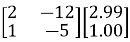 = 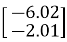
			

			

				Then, <strong>Ax.x = </strong>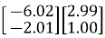 = -20.0 (approx.)
			

			

				And <strong>x.x </strong>=  =  = 9.94 (approx.)
			

			

				So, the corresponding eigenvalue, λ = (-20.0 / 9.94) = -2 (approx.)
			

			

				&#xa0;
			

			

				<strong>Singular Value Decomposition (SVD)</strong>
			

			

				<strong>Theory:</strong>
			

			

				Singular Value Decomposition (SVD) is a matrix factorization technique that decomposes any m×n matrix A into three matrices: A=UΣVT 
			

			

				Where:
			

			<ul>
				<li>
					U is an m×m orthogonal matrix (or unitary if complex).
				</li>
				<li>
					Σ is m×n diagonal matrix with non-negative real numbers on the diagonal (singular values).
				</li>
				<li>
					VT is an n×n orthogonal matrix (or unitary if complex), and VT is the transpose of V.
				</li>
			</ul>
			

				<strong>Example</strong>
			

			

				A = 
			

			

				&#xa0;
			

			

				Compute ATA and AAT
			

			

				&#xa0;
			

			

				ATA = 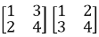 = 
			

			

				&#xa0;
			

			

				AAT = 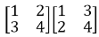 = 
			

			

				&#xa0;
			

			

				<strong>Find Eigenvalues and Eigenvectors</strong>:
			

			

				For ATA:
			

			<ul>
				<li>
					Eigenvalues are λ1= 29.8661 and λ2 = 0.1339
				</li>
				<li>
					Corresponding eigenvectors (normalized) are v1 = and v2 = 
				</li>
			</ul>
			

				For AAT:
			

			<ul>
				<li>
					Eigenvalues are λ1= 29.8661 and λ2 = 0.1339
				</li>
				<li>
					Corresponding eigenvectors (normalized) are u1 = and u2 = 
				</li>
			</ul>
			

				&#xa0;
			

			

				<strong>Compute Singular Values</strong>:
			

			

				Singular values are σ1 = √ 29.8661= 5.4650
			

			

				And σ1 = √ 0.1339 = 0.3660
			

			

				&#xa0;
			

			

				<strong>Final SVD:</strong>
			

			

				A=UΣVT
			

			

				Where: 
			

			

				U = 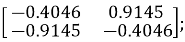&#xa0; Σ = 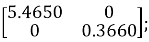&#xa0; 
			

			

				VT = 
			

			

				&#xa0;
			

			

				<strong>LU Decomposition</strong>
			

			

				LU Decomposition is a method to find solutions of linear equations.
			

			

				&#xa0;
			

			

				Using Gauss Elimination Method 
			

			

				&#xa0;
			

			

				Consider a matrix&#xa0;𝐴. If all entries below the diagonal entries are zero, then the matrix is called “upper triangular.” If all entries above the diagonal entries are zero, then the matrix is called “lower triangular.” 
			

			

				&#xa0;&#xa0;&#xa0;&#xa0;&#xa0;&#xa0;&#xa0;&#xa0; And <strong>A = L*U</strong>
			

			

				<strong>L</strong> =&#xa0; ;&#xa0;&#xa0; <strong>U</strong> = 
			

			

				&#xa0;
			

			

				<strong><em>L= lower triangular matrix; U= upper triangular matrix</em></strong>
			

			

				&#xa0;
			

			

				<strong>Procedure-</strong>
			

			<ol>
				<li>
					Choose a matrix (<strong>m X n) </strong>(e.g., 3X 3, 3 X 4, 4 X 4, etc.,)
				</li>
			</ol>
			

				&#xa0;
			

			<ol start="2">
				<li>
					Initialize the <strong>L</strong> and <strong>U </strong>matrices. For L matrix, take a matrix with all diagonal elements assigned to 1, and the remaining components are zero. L matrix size will be (<strong>m X m</strong>). 
				</li>
			</ol>
			

				&#xa0;
			

			<ol start="3">
				<li>
					Consider the <strong>U</strong> matrix's elements to be same to those of the <strong>A</strong> matrix. So, size of matrix <strong>U </strong>will be as same as matrix<strong> A</strong>.
				</li>
			</ol>
			

				&#xa0;
			

			

				&#xa0;
			

			<ol start="4">
				<li>
					4. Next, execute row operations on the <strong>U</strong> matrix to make sure that all of the components below the diagonal are zeroes. For instance, to make an element in row 2 or R2 at the (i,j)th position zero, we would first do 
				</li>
			</ol>
			

				&#xa0;
			

			

				"R2 - (-2)*R1" 
			

			

				&#xa0;
			

			

				and then set the value ‘(-2)’ at the (i,j)th place of the L Matrix.
			

			

				&#xa0;
			

			<ol start="5">
				<li>
					For a given matrix
				</li>
			</ol>
			

				<strong>A</strong> = 
			

			

				&#xa0;
			

			

				<strong>A=L*U</strong>
			

			

				Or, <strong>A</strong>=* 
			

			

				&#xa0;
			

			

				<strong><em>L= lower triangular matrix; U= upper triangular matrix</em></strong>
			

			

				&#xa0;
			

			

				After doing the row&#xa0;operation "R2 - (-2)*R1," we get,
			

			

				&#xa0;
			

			

				Or, <strong>A</strong> = 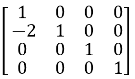* 
			

			

				&#xa0;
			

			

				After row operation in matrix <strong>U</strong>, we've set (-2) to the same place of the<strong> L</strong> matrix and the (2, 1)th position of the U matrix, which is now zero.
			

			

				Firstly, try the first column elements of matrix <strong>U</strong> below diagonal elements to make zeroes,
			

			

				&#xa0;
			

			

				After doing,&#xa0;&#xa0;&#xa0;&#xa0;&#xa0;&#xa0;&#xa0;&#xa0;&#xa0; ‘R2-(-2)*R1’ <em>(as demonstrated above)</em>
			

			

				&#xa0;&#xa0;&#xa0;&#xa0;&#xa0;&#xa0;&#xa0;&#xa0;&#xa0;&#xa0;&#xa0;&#xa0;&#xa0;&#xa0;&#xa0;&#xa0;&#xa0;&#xa0;&#xa0;&#xa0;&#xa0;&#xa0;&#xa0;&#xa0;&#xa0;&#xa0;&#xa0;&#xa0;&#xa0; ‘R3-(3)*R1’ and
			

			

				&#xa0;&#xa0;&#xa0;&#xa0;&#xa0;&#xa0;&#xa0;&#xa0;&#xa0;&#xa0;&#xa0;&#xa0;&#xa0;&#xa0;&#xa0;&#xa0;&#xa0;&#xa0;&#xa0;&#xa0;&#xa0;&#xa0;&#xa0;&#xa0;&#xa0;&#xa0;&#xa0;&#xa0;&#xa0; ‘R4-(2)*R1’
			

			

				We get,
			

			

				&#xa0;
			

			

				<strong>A</strong> = 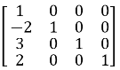* 
			

			

				&#xa0;
			

			

				In a same way, we will now employ row operations to set the elements of the second column of matrix <strong>U</strong> to zero.
			

			

				&#xa0;
			

			

				Calculate,&#xa0;&#xa0;&#xa0; ‘R3-(-4)*R2’ and
			

			

				&#xa0;&#xa0;&#xa0;&#xa0;&#xa0;&#xa0;&#xa0;&#xa0;&#xa0;&#xa0;&#xa0;&#xa0;&#xa0;&#xa0;&#xa0;&#xa0;&#xa0;&#xa0;&#xa0; ‘R4-(1)*R2’
			

			

				&#xa0;
			

			

				We get,
			

			

				<strong>A</strong> = 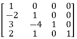* 
			

			

				&#xa0;
			

			

				Now, we'll apply row operations to convert the elements of the third column of matrix <strong>U</strong> to zeroes.
			

			

				&#xa0;
			

			

				Now calculate "R4-(3)*R2"
			

			

				We get,
			

			

				&#xa0;
			

			

				<strong>A</strong> = * 
			

			

				&#xa0;
			

			

				So, 
			

			

				&#xa0;
			

			

				<strong>L</strong> = 
			

			

				&#xa0;
			

			

				<strong>U</strong> = 
			

			

				&#xa0;
			

			<ol start="6">
				<li>
					<strong>Before showing the final result, all intermediate steps must be displayed.</strong>
				</li>
			</ol>
			

				&#xa0;
			

			

				<strong>Row Echelon Form</strong>
			

			

				A matrix is in row echelon form if
			

			<ul>
				<li>
					All rows consisting of only zeroes are at the bottom.
				</li>
				<li>
					The leading entry (that is the left-most nonzero entry) of every nonzero row is to the right of the leading entry of every row above
				</li>
				<li>
					Some texts add the condition that the leading coefficient must be 1 while others regard this as reduced row echelon form
				</li>
				<li>
					These two conditions imply that all entries in a column below a leading coefficient are zeros
				</li>
			</ul>
			

				&#xa0;
			

			

				<strong>Procedure</strong>
			

			<ol>
				<li>
					Choose an m X n matrix
				</li>
				<li>
					All zero rows are at the bottom. 
				</li>
				<li>
					Choose the leading entry in the first non-zero row and swap it with the first row if necessary. Or, the leading entry/element in the first row must be non-zero.
				</li>
				<li>
					Divide the first row by the leading entry so that the leading entry becomes 1.
				</li>
				<li>
					Use row operations to make all entries in the first column below the leading entry equal to 0.
				</li>
				<li>
					Repeat steps 3 through 5 for each subsequent row, working from top to bottom.
				</li>
			</ol>
			

				&#xa0;
			

			

				These conditions also imply that all entries in a column below a leading coefficient are zeros
			

			

				&#xa0;
			

			

				<strong>Example</strong>
			

			

				Given matrix,
			

			

				<strong>A = </strong>
			

			

				&#xa0;
			

			

				R2 ← R2 – R1
			

			

				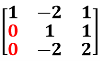
			

			

				<strong>&#xa0;</strong>
			

			

				R3 ← R3 + 2*R2
			

			

				
			

			

				<strong>&#xa0;</strong>
			

			

				R3 ← R3 / 4
			

			

				
			

			

				&#xa0;
			

			

				<strong>Reduced Row Echelon Form (RREF)</strong>
			

			

				<strong>Procedure</strong>
			

			<ol>
				<li>
					Choose an m X n matrix
				</li>
				<li>
					All zero rows are at the bottom. 
				</li>
				<li>
					Choose the leading entry in the first non-zero row and swap it with the first row if necessary.
				</li>
				<li>
					Divide the first row by the leading entry so that the leading entry becomes 1.
				</li>
				<li>
					Use row operations to make all entries in the first column above and below the leading entry equal to 0.
				</li>
				<li>
					Repeat steps 3 through 5 for each subsequent row, working from top to bottom.
				</li>
				<li>
					After all, rows have been processed, the matrix is in reduced row echelon form.
				</li>
			</ol>
			

				&#xa0;
			

			

				<strong>Example:</strong>
			

			

				Given matrix <strong>A </strong>= 
			

			

				&#xa0;
			

			

				R2 ← R2 – 2*R1 <em>(R1 denotes row 1 and so on)</em>
			

			

				
			

			

				&#xa0;
			

			

				R3 ← R3 – 3*R1
			

			

				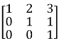
			

			

				&#xa0;
			

			

				&#xa0;
			

			

				R1 ← R1 – 2*R2
			

			

				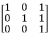
			

			

				&#xa0;
			

			

				R1 ← R1 – R3
			

			

				
			

			

				&#xa0;
			

			

				R2 ← R2 – R3
			

			

				
			

			

				&#xa0;
			

			

				<strong>Rank of a Matrix</strong>
			

			

				<strong>Theory:</strong>
			

			

				<strong>Definition</strong>: The rank of a matrix is defined as the maximum number of linearly independent rows (or columns) in the matrix. It can also be seen as the dimension of the row space or column space of the matrix.
			

			

				&#xa0;
			

			

				<strong>Rank of a Matrix in Row Echelon Form (REF)</strong>
			

			<ol>
				<li>
					<strong>Row Echelon Form (REF)</strong>: A matrix is in row echelon form when:
					<ul>
						<li>
							All non-zero rows are above any rows of all zeros.
						</li>
						<li>
							The leading entry (pivot) of each non-zero row is to the right of the leading entry of the row above it.
						</li>
						<li>
							All entries below a pivot are zero.
						</li>
					</ul>
				</li>
			</ol>
			

				&#xa0;
			

			<ol start="2">
				<li>
					<strong>Finding the Rank</strong>:
					<ul>
						<li>
							<strong>Identify Non-Zero Rows</strong>: In REF, the rank of the matrix is equal to the number of non-zero rows. This is because each non-zero row represents a linearly independent vector in the row space of the matrix.
						</li>
						<li>
							<strong>Process</strong>: Convert the matrix to REF using row operations (row swapping, scaling rows, adding/subtracting multiples of rows) and count the number of non-zero rows to determine the rank.
						</li>
					</ul>
				</li>
			</ol>
			

				&#xa0;
			

			

				<strong>Rank of a Matrix in Reduced Row Echelon Form (RREF)</strong>
			

			

				<strong>Theory:</strong>
			

			<ol>
				<li>
					<strong>Reduced Row Echelon Form (RREF)</strong>: A matrix is in reduced row echelon form when:
					<ul>
						<li>
							It is in row echelon form (REF).
						</li>
						<li>
							Each leading entry (pivot) is 1.
						</li>
						<li>
							Each leading 1 is the only non-zero entry in its column.
						</li>
						<li>
							All rows with leading 1s are above rows of all zeros.
						</li>
					</ul>
				</li>
			</ol>
			

				&#xa0;
			

			<ol start="2">
				<li>
					<strong>Finding the Rank</strong>:
					<ul>
						<li>
							<strong>Count Leading 1s</strong>: In RREF, the rank of the matrix is equal to the number of leading 1s. Each leading 1 represents a pivot position in a linearly independent row.
						</li>
						<li>
							<strong>Process</strong>: Convert the matrix to RREF using row operations (pivoting, scaling, and clearing entries above and below pivots) and count the number of leading 1s to determine the rank.
						</li>
					</ul>
				</li>
			</ol>
 
</body>
</html>
>>>>>>> bfb9e6c (Dev Files)
